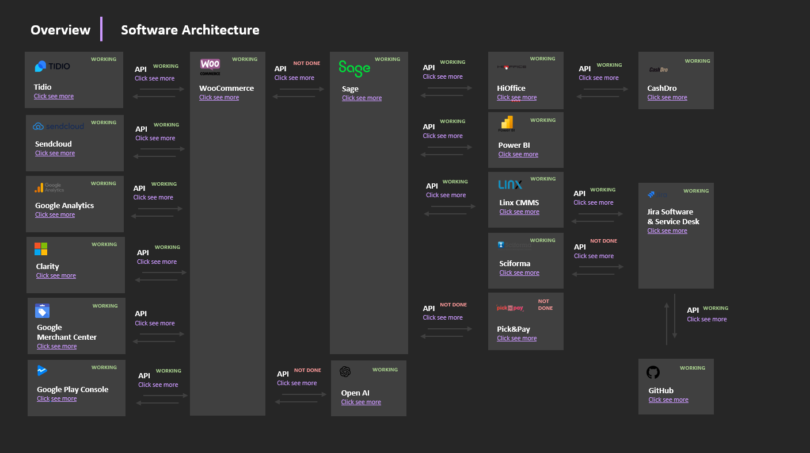

# Overview
Este documento es para definir los sistemas y API's en **Group MIM** con el objetivo de hacer un sistema sostenible que sea escalable, fiable i dinámico. 

## Principales Sistemas
- **ERP** - Sage ERP

- **Systems** 
- **** - WooCommerce
- **** - Sendcloud
- **** - Sciforma
- **** - Tidio
- **** - Zoho CRM
- **** - GMAO Linx
- **** - Google Analytics
- **** - HiOffice TPV
- **** - Google Search Console

